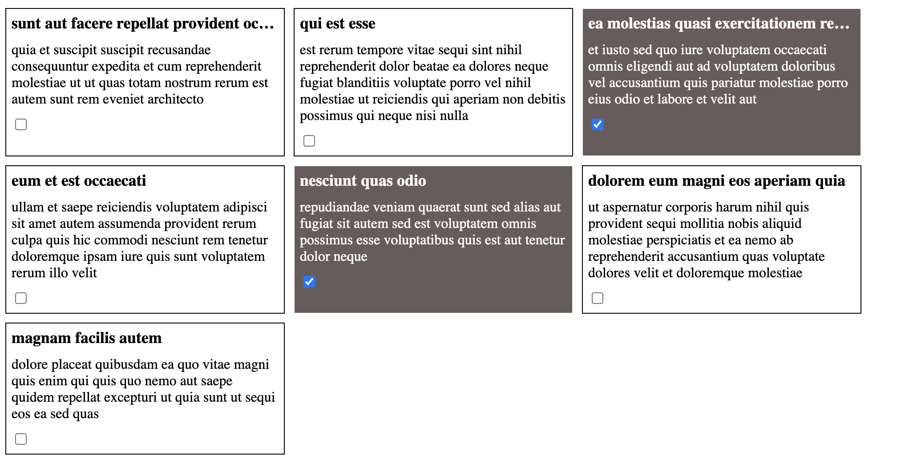

### [🔗 click link](https://www.drill.yuliyakalyukh.ru)

# Задача

1. Сделать GET запрос
2. Обработать ответ и отрисовать элементы массива в html
3. К каждому элементу добавить чекбокс
4. При активном чекбоксе фон должен становиться темным, текст светлым
5. Добавить текстовый фильтр по заголовку
6. Состояние фильтра должно сохраняться в адресную строку бразуера
7. Фильтрация должна работать после нажатия на кнопку «найти»
8. После перезагрузки обновления окна, состояние страницы/фильтра должно сохраняться
9. Если длина заголовка превышает ширину блока, не переносить заголовок на вторую строку, а обрезать его троеточием
10. Использовать только html, css, js (не использовать фреймворки и библиотеки)

Пример выполненного задания на скриншоте (на скриншоте нет формы с фильтрами)

